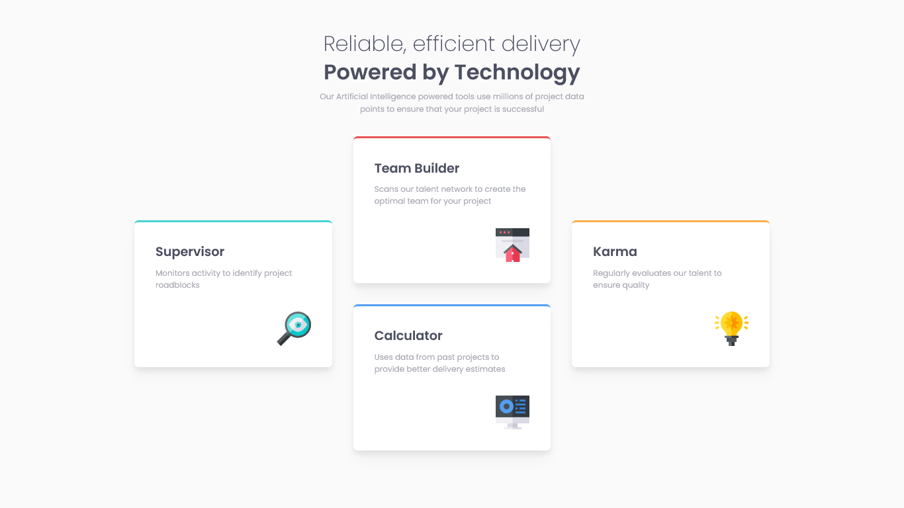

# Frontend Mentor - Four card feature section solution

This is a solution to the [Four card feature section challenge on Frontend Mentor](https://www.frontendmentor.io/challenges/four-card-feature-section-weK1eFYK). Frontend Mentor challenges help you improve your coding skills by building realistic projects.

## Table of contents

- [Overview](#overview)
  - [The challenge](#the-challenge)
  - [Screenshot](#screenshot)
  - [Links](#links)
- [My process](#my-process)
  - [Built with](#built-with)
  - [What I learned](#what-i-learned)

## Overview

### The challenge

Users should be able to:

- View the optimal layout for the site depending on their device's screen size

### Screenshot

### Links

- Solution URL: [Github](https://github.com/Adel-Harrat/FM-Four-card-feature-section)
- Live Site URL: [Vercel](https://fm-four-card-feature-section-rosy.vercel.app/)

## My process

### Built with

- Semantic HTML5 markup
- CSS Grid
- Mobile-first workflow
- [React](https://reactjs.org/) - JS library
- TailwindCss - CSS Framework

### What I learned

I recently acquired the skills to use CSS Grid in conjunction with Tailwind CSS. This involved mastering concepts such as `grid-template-columns`, `grid-template-rows`, `grid-area`, `align-self` and `gap`. It was a fantastic opportunity to apply and strengthen my knowledge of CSS Grid. Additionally, I have been utilizing React's reusable components to enhance the efficiency and modularity of my code. Overall, this combination of technologies has been a perfect platform for me to practice and refine my CSS Grid skills.
